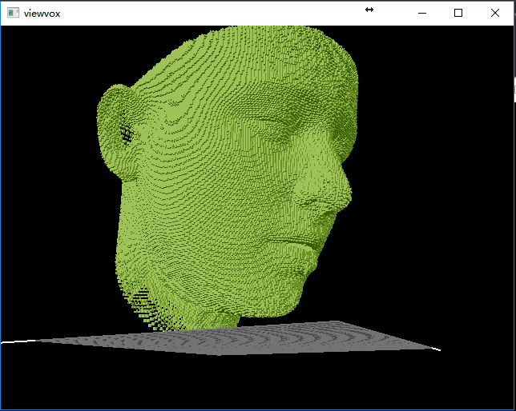
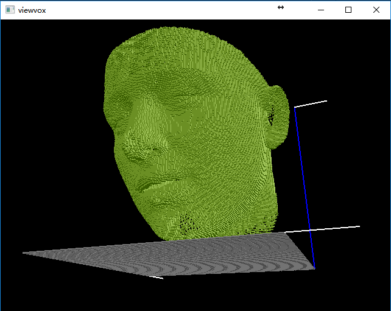

# README

This project's aim is to voxelize the `*.ply` 3D model.
But only for `ply` files, all [assimp support files ](
http://assimp.sourceforge.net/main_features_formats.html) can be voxelized.

# Import formats
Autodesk ( .fbx ), Collada ( .dae ), glTF ( .gltf, .glb ), Blender 3D ( .blend ),
 3ds Max 3DS ( .3ds ), 3ds Max ASE ( .ase ), Wavefront Object ( .obj ),
Industry Foundation Classes (IFC/Step) ( .ifc ), XGL ( .xgl,.zgl ),
Stanford Polygon Library ( .ply ), AutoCAD DXF ( .dxf ), LightWave ( .lwo ),
LightWave Scene ( .lws ), Modo ( .lxo ), Stereolithography ( .stl ),
DirectX X ( .x ), AC3D ( .ac ), Milkshape 3D ( .ms3d ), TrueSpace ( .cob,.scn )

# Export voxel formats
## numpy
A numpy array with shape of you appointed.Example: you give a vexel size of (100, 100, 100).
It will return a numpy array with shape (100, 100, 100).
Filename: `imagename.npy`

When you need to import it, using `numpy.load(filename)`.

## JSON
For more convenient usage, it export a json file. Just reshape the numpy array to
(-1, ) . As it shown below:

```JSON
    '[0,1,0,1]'
```
Filename: `iamgename.json`

## binvox
A format of [binvox](http://www.patrickmin.com/binvox/), using [binvox-rw-py
](https://github.com/dimatura/binvox-rw-py) to write out `.binvox` file to floder.

Using this format, you can easily got the result in eyes with [viewvox]().

## Requires

- [pyassimp 3](https://github.com/assimp/assimp/blob/master/port/PyAssimp/README.md)
- [numpy](http://www.numpy.org/)
- [python 2.7](https://www.python.org/downloads/)
- [pyflann](https://github.com/primetang/pyflann)

## Useage

```
>>> import voxelization
>>> voxelization.voxelization("134212_1.ply")
('Bounding box: ', 350.86337, 268.0675, 62.311089, 140.45639, 59.910782, -137.18449)
('x_edge: ', 1.0958697001139324, '\ny_edge: ', 1.0841495990753174, '\nz_edge: ', 0.99747787475585936, '\nedge: ', 1.0958697001139324)
('The mesh ', '0', ' has vertices: ', (53215, 3))
('The mesh', '0', ' process successfully in ', 530.8458249568939, 's')
calculate all meshes voxel finished!
array([[[0, 0, 0, ..., 0, 0, 0],
            ......
        [0, 0, 0, ..., 0, 0, 0]]], dtype=int8)
>>>
```

## Show
There is some works of the app. Those screenshot pictures are using [viewvox](http://www.patrickmin.com/viewvox/) Application.





## Requires Introduction

### PyAssimp
PyAssimp can import and export many formats of 3-D models, very useful.

### numpy
NumPy is the fundamental package for scientific computing with Python.

### PyFlann
FLANN (Fast Library for Approximate Nearest Neighbors) is a library for
performing fast approximate nearest neighbor searches. FLANN is written in
the C++ programming language. FLANN can be easily used in many contexts
through the C, MATLAB and Python bindings provided with the library.
